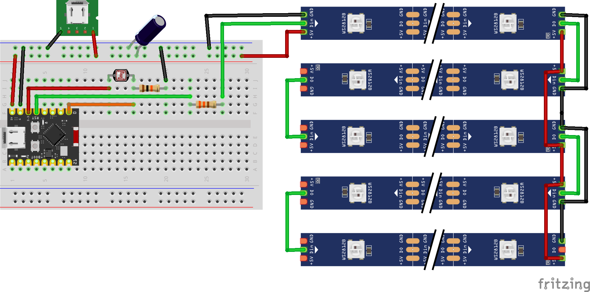
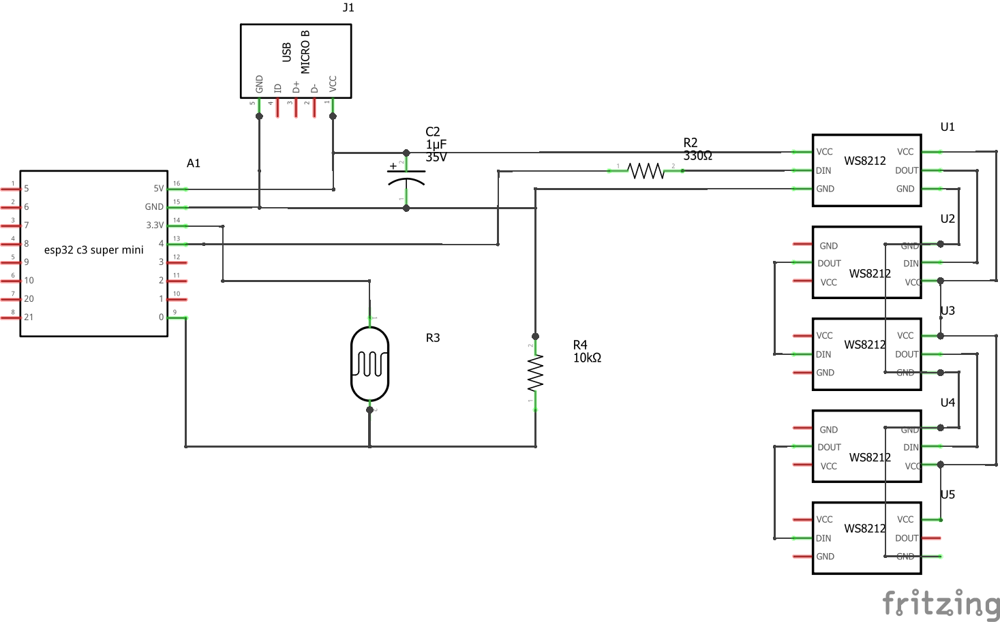

# Rainbow Lamp project

This is the code for my Wifi-connected rainbow-lamp project.  
The hardware is based on an ESP32-C3 super mini and a WS2812B-led strip in a custom designed 3d-printed enclosure in the form of a Rainbow and clouds.  


## Features & Functionality
- **Home Assistant Native Integration**: Automatically discovered in Home Assistant using MQTT.
- **Captive Portal Setup**: Uses WiFiManager. If it can't connect to WiFi, it spins up an Access Point (`RainbowLamp_Setup`) where you can configure WiFi and MQTT credentials via your browser (times out after 5 minutes, after which it enters offline mode).
- **Animations**: Includes a few fun animations (Rainbow Chase, Pulse, Sparkle) selectable via Home Assistant. Animations automatically revert to the normal static rainbow after 5 minutes.
- **Auto-Brightness**: Adjusts brightness automatically using a photoresistor (LDR) and reports the ambient light level back to Home Assistant (0-100%).
- **OTA Updates**: Supports over-the-air firmware flashing via PlatformIO.
- **Hardware Watchdog**: Built-in ESP32 task watchdog ensures the lamp automatically recovers if an animation loop ever stalls (automatically bypassed during OTA updates to prevent reboots during flashing).

## 3D-printed parts
stl:s for 3D-printed parts can be found at [Printables](https://www.printables.com/@christofferra_319142/models)

## Hardware
1 x [ESP32 C3 Super Mini](https://vi.aliexpress.com/item/1005005877531694.html?spm=a2g0n.order_detail.order_detail_item.3.a634f19cQ7qrTO&gatewayAdapt=glo2vnm)  
1 x [Female USB-C break out board](https://vi.aliexpress.com/item/1005001337982060.html?spm=a2g0n.order_detail.order_detail_item.3.ef6bf19c29O4VV&gatewayAdapt=glo2vnm)  
1 x [1m WS2812B, 144led/m IP30](https://vi.aliexpress.com/item/32682015405.html?spm=a2g0n.order_detail.order_detail_item.3.539ff19cSsUslW&gatewayAdapt=glo2vnm)  
1 x [GL-5516 LDR Photo resistor](https://vi.aliexpress.com/item/32833626809.html?spm=a2g0n.order_detail.order_detail_item.3.5e5ef19cr6tEi6&gatewayAdapt=glo2vnm)  
1 x 25v 1000microF Electrolytic capacitor  
1 x 330 ohm resistor  
1 x 10kohm resistor  
6 x M2 * L5 * D3.5 brass inserts  
10 x M2 * L8  

### Pin Mapping
- **WS2812B LED Strip**: GPIO 4
- **LDR Photoresistor (Analog)**: GPIO 0

### Circuit diagram



## Setup and Installation

### Prerequisites
- PlatformIO IDE installed in VS Code or CLI.
- ESP32 board definitions and libraries (handled automatically by PlatformIO on build).

### Configuration
1. Clone or copy the project files to your working directory.
2. Ensure you have the `platformio.ini` configured correctly for the `lolin_c3_mini` environment.
3. The OTA password can be defined in `platformio.ini` with `-D OTA_PASSWORD='"your_password"'`.

### Initial Flash
For the first setup, connect the ESP32-C3 Super Mini to your computer via USB:

1. Build and upload the project using PlatformIO via serial port.
2. Open the Serial Monitor at `115200` baud.

### WiFi and MQTT Provisioning
1. When the device boots for the first time, it creates a wireless access point named `RainbowLamp_Setup`.
2. Connect to the access point with a smartphone or computer.
3. A captive portal page should open automatically. If not, navigate to `192.168.4.1` in your browser.
4. Input your WiFi credentials along with your MQTT Server IP, username, and password.
5. The device will save these settings, connect to your WiFi, and start publishing to MQTT.

## Home Assistant Integration
Once connected to your MQTT broker, the device uses the Home Assistant MQTT discovery protocol to automatically register. It exposes the following entities under the device **Rainbow Light**:

- **switch.power**: Controls the power state of the LEDs.
- **number.brightness**: Controls the brightness level of the LEDs (only effective when auto-brightness is off).
- **switch.auto_brightness**: Toggles the automatic brightness adjustment based on the ambient light sensor.
- **sensor.light_level**: Current ambient light level mapped from 0-100%.
- **sensor.signal_strength**: Current WiFi RSSI in dBm.
- **select.animation**: Select an animation to play for 5 minutes (`Normal`, `Rainbow Chase`, `Pulse`, `Sparkle`).

## Over-the-Air (OTA) Updates
Once configured and connected to your network, you can upload new code over-the-air using PlatformIO:

```bash
pio run -t upload --upload-port rainbow_lamp.local
```
*(You can also configure this upload port in platformio.ini)*

The hardware watchdog task is automatically bypassed during OTA updates to prevent any reboots during the flash process.
