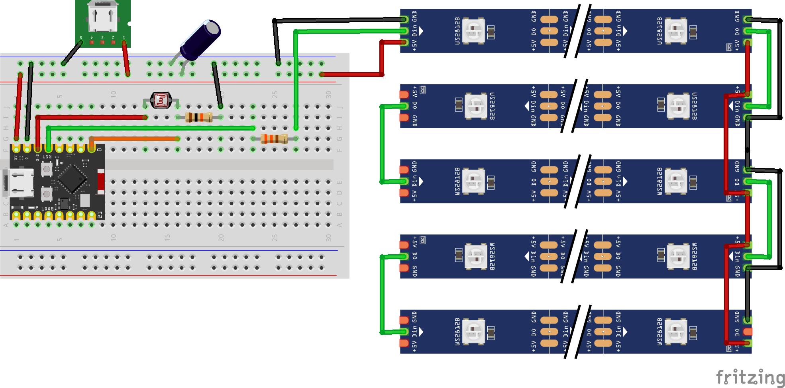

# Rainbow Lamp project

This is the code for my Wifi-connected rainbow-lamp project.  
The hardware is based on an ESP32-C3 super mini and a WS2812B-led strip in a custom designed 3d-printed enclosure in the form of a Rainbow and clouds.  

## Basic functionality
- Light Rainbow (doh)
- Auto adjust brightness according to ambient light conditions
- Upload ambient light conditions to MQTT-server if provided, 0-4095
- Listen for messages from MQTT-server, if provided, to turn on/off light
- Wifi connection animations

## 3D-printed parts
stl:s for 3D-printed parts can be found at [Printables](https://www.printables.com/@christofferra_319142/models)

## Hardware
1 x [ESP32 C3 Super Mini](https://vi.aliexpress.com/item/1005005877531694.html?spm=a2g0n.order_detail.order_detail_item.3.a634f19cQ7qrTO&gatewayAdapt=glo2vnm)  
1 x [Female USB-C break out board](https://vi.aliexpress.com/item/1005001337982060.html?spm=a2g0n.order_detail.order_detail_item.3.ef6bf19c29O4VV&gatewayAdapt=glo2vnm)  
1 x [1m WS2812B, 144led/m IP30](https://vi.aliexpress.com/item/32682015405.html?spm=a2g0n.order_detail.order_detail_item.3.539ff19cSsUslW&gatewayAdapt=glo2vnm)  
1 x [GL-5516 LDR Photo resistor](https://vi.aliexpress.com/item/32833626809.html?spm=a2g0n.order_detail.order_detail_item.3.5e5ef19cr6tEi6&gatewayAdapt=glo2vnm)  
1 x 25v 1000microF Electrolytic capacitor  
1 x 330 ohm resistor  
1 x 10kohm resistor  
6 x M2 * L5 * D3.5 brass inserts  
10 x M2 * L8  

### Circuit diagram

